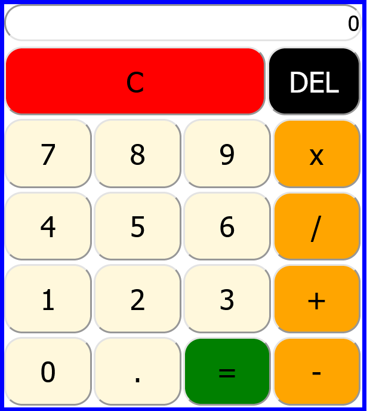

# JavaScript Simple Calculator 

A simple operations calculator created with HTML, CSS, and JavaScript.

### Click [Here](https://iceeeberg.github.io/Calculator/) To Perform Some Calculations. 

## Summary

Building this applicaiton taught me the importance of using the developer tools and how it can aid with debugging. It was a huge stepping stone in my journey into becoming a software developer. It taught me one of the major skills a developer must have is to understand how to use the developer tools in order to work through the functionalities of any application. Mastering this skill will simplify the day to day work of debugging. 

## Author 

Dante Leeseberg - Full Stack Software Developer [LinkedIn](https://www.linkedin.com/in/dante-leeseberg-bba05883/)